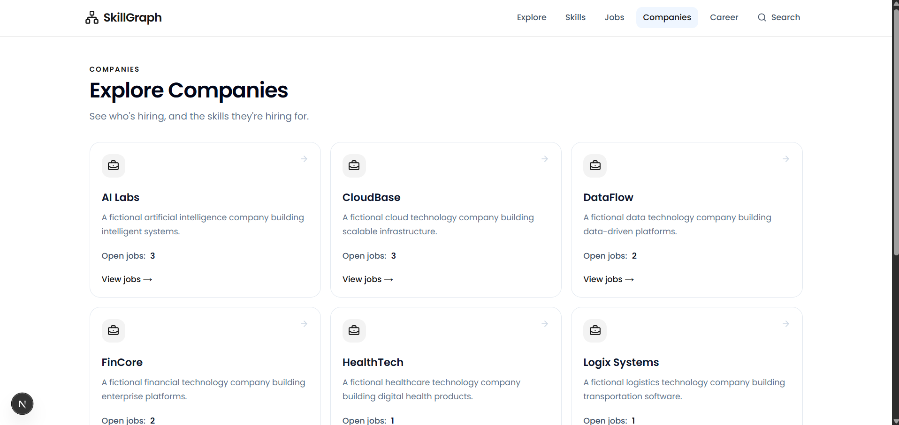

# SkillGraph

SkillGraph is a graph-based career recommendation platform that connects a person's current skills and experience level to relevant career opportunities.

It analyzes the relationship between **people, skills, jobs, and companies** to identify suitable career paths, matching skills, missing skills, and additional skills that can unlock more opportunities.

## Features

### People Directory

* View available candidates.
* See each person's experience level and location.
* Select a candidate to explore their career path.

### Career Path

Each candidate has a personalized career path showing:

* Candidate profile information.
* Current skills.
* Recommended career opportunities.
* Match percentage for each opportunity.
* Skills that match the opportunity.
* Missing skills required for the opportunity.
* Additional skills the candidate could learn.

### Career Recommendations

Career opportunities are ranked according to skill compatibility.

Each recommendation displays:

* Job title.
* Company.
* Match percentage.
* Matched skills.
* Missing skills.

### Skills to Learn

SkillGraph identifies skills that can potentially unlock additional career opportunities.

For each skill, the platform shows the number of jobs associated with that skill.

## Tech Stack

### Frontend

* Next.js
* React
* TypeScript
* Tailwind CSS
* React Query
* Axios
* Lucide React

### Backend

* Node.js
* Express.js
* TypeScript
* CognoDB
* Cypher

### Development Tools

* pnpm
* Git
* GitHub
* Postman

## Application Flow

```text
People Directory
      │
      ├── Select Candidate
      │
      ▼
Career Path
      │
      ├── Candidate Profile
      │
      ├── Current Skills
      │
      ├── Career Recommendations
      │       ├── Match Percentage
      │       ├── Matched Skills
      │       └── Missing Skills
      │
      └── Skills To Learn
              └── Additional Job Opportunities
```

## API

### Get All People

```http
GET /api/people
```

Returns the available candidates.

Example response:

```json
{
  "success": true,
  "data": [
    {
      "id": "person-alex",
      "name": "Alex Johnson",
      "experienceLevel": "Junior",
      "location": "Lagos"
    }
  ]
}
```

### Get Candidate Career Path

```http
GET /api/career/:personId/paths
```

Example:

```http
GET /api/career/person-daniel/paths
```

The endpoint returns:

* Candidate information.
* Current skills.
* Recommended career opportunities.
* Match percentages.
* Matched skills.
* Missing skills.
* Skills to learn.

## Project Structure

```text
.
├── client/
│   └── src/
│       ├── app/
│       │   ├── career/
│       │   ├── companies/
│       │   ├── jobs/
│       │   ├── search/
│       │   └── skills/
│       ├── components/
│       └── features/
│
├── server/
│   └── src/
│       ├── db/
│       ├── middleware/
│       ├── queries/
│       └── module/
│           ├── career/
│           └── person/
│
├── docs/
│   └── screenshots/
│
└── README.md
```

## Screenshots

Screenshots of the application are available in:

```text
docs/screenshots/
```

### Explore Page


### People / Career Path


### Jobs


### Skills


### Companies



## Running Locally

### Prerequisites

Make sure you have the following installed:

* Node.js
* pnpm
* CognoDB access

### Install Dependencies

From the project root:

```bash
pnpm install
```

If the frontend and backend use separate package files:

```bash
cd client
pnpm install
```

```bash
cd ../server
pnpm install
```

## Environment Variables

Create a `.env` file inside the `server` directory:

```env
COGNODB_URI=your_cognodb_uri
COGNODB_USERNAME=cognodb
COGNODB_PASSWORD=your_cognodb_password
```

Create/configure the frontend environment file with the backend API URL:

```env
NEXT_PUBLIC_API_URL=http://localhost:5000/api
```

Do not commit `.env` files or expose database credentials.

## Start the Backend

```bash
cd server
pnpm dev
```

The backend runs on:

```text
http://localhost:5000
```

## Start the Frontend

In another terminal:

```bash
cd client
pnpm dev
```

The frontend runs on:

```text
http://localhost:3000
```

## Example Career Recommendation

For a candidate with the following skills:

```text
JavaScript
Node.js
Express.js
MongoDB
Git
```

SkillGraph can identify a relevant opportunity such as:

```text
Backend Developer
67% Match

Matched Skills:
✓ Node.js
✓ Express.js

Missing Skill:
PostgreSQL
```

The platform can also identify skills that may unlock additional opportunities:

```text
PostgreSQL
React
Docker
TypeScript
REST API
```

## Recommendation Logic

SkillGraph compares a candidate's existing skills against the skills required by available jobs.

The recommendation process identifies:

1. Skills the candidate already has.
2. Skills required by each job.
3. Skills shared between the candidate and the job.
4. Missing skills.
5. A match percentage based on skill compatibility.
6. Additional skills that could unlock more opportunities.

## Design Goals

The application was designed around three main principles:

### 1. Skill-Based Recommendations

Connect a candidate's existing skills to relevant career opportunities.

### 2. Actionable Skill Gaps

Clearly show which skills are missing for a potential career path.

### 3. Career Discovery

Help candidates understand which skills they can learn to expand their available career opportunities.

## Status

The core SkillGraph career recommendation experience is complete.

It includes:

* People directory.
* Candidate career paths.
* Skill matching.
* Career recommendations.
* Match percentages.
* Missing skill identification.
* Skills-to-learn recommendations.
* Jobs, skills, and companies exploration.
* Backend API integration.
* CognoDB graph-based queries.
