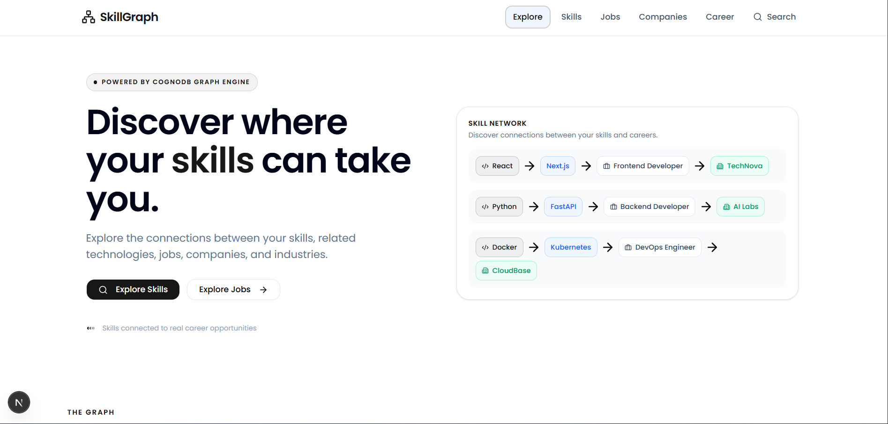
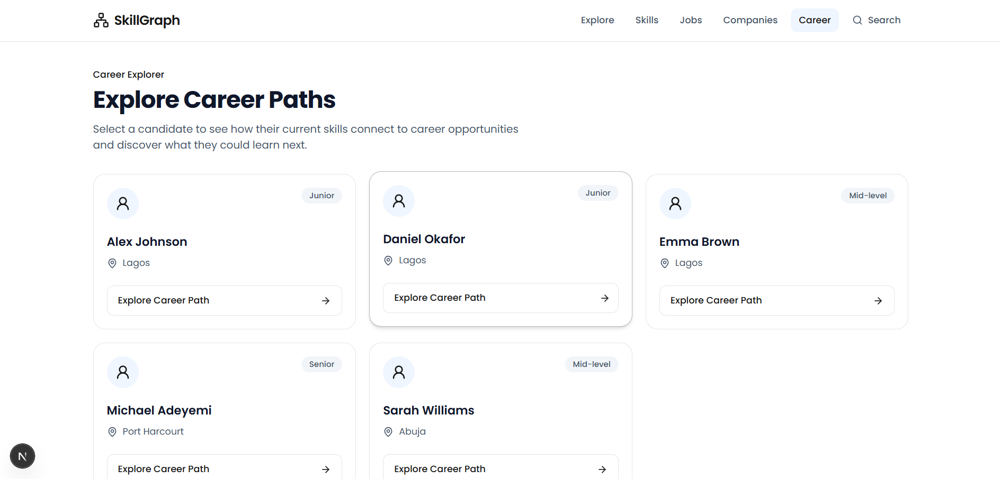
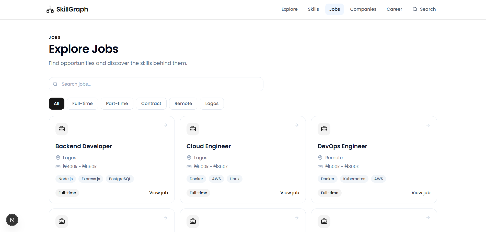
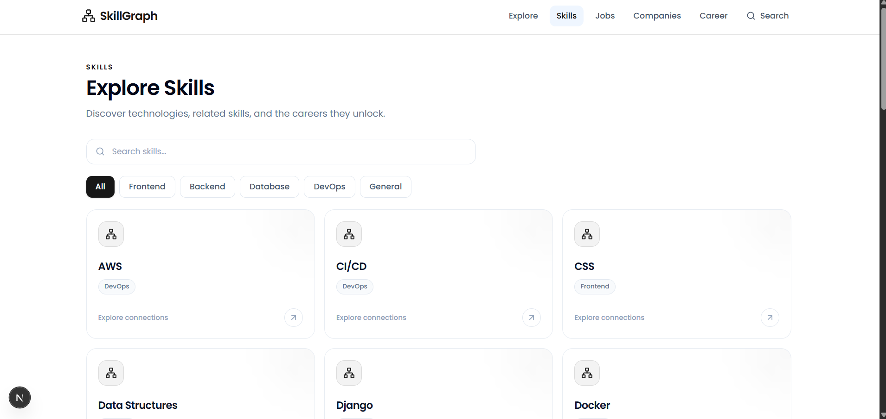

# SkillGraph

SkillGraph is a graph-based career recommendation platform that connects a person's current skills and experience level to relevant career opportunities.

It analyzes the relationships between **people, skills, jobs, and companies** to identify suitable career paths, matching skills, missing skills, and additional skills that can unlock more opportunities.

## Live Demo

**Frontend:** https://skill-graph-umber-seven.vercel.app/

**Backend API:** https://skillgraph-5obp.onrender.com/

## Features

### People Directory

* View available candidates.
* See each person's experience level and location.
* Select a candidate to explore their career path.

### Career Path

Each candidate has a personalized career path showing:

* Candidate profile information.
* Current skills.
* Recommended career opportunities.
* Match percentage for each opportunity.
* Skills that match the opportunity.
* Missing skills required by the opportunity.
* Additional skills the candidate could learn.

### Career Recommendations

Career opportunities are ranked according to skill compatibility.

Each recommendation displays:

* Job title.
* Company.
* Match percentage.
* Matched skills.
* Missing skills.

### Skills to Learn

SkillGraph identifies skills that can potentially unlock additional career opportunities.

For each skill, the platform shows the number of jobs associated with that skill.

### Jobs, Skills & Companies

The platform also provides dedicated exploration pages for:

* Jobs
* Skills
* Companies
* People
* Search

These pages allow users to explore the career graph beyond individual recommendations.

## Why a Graph Database?

Career recommendations are fundamentally based on relationships between **people, skills, jobs, and companies**.

A traditional relational database could represent these entities using separate tables, but finding career opportunities would require multiple joins across those tables.

A graph database represents these relationships directly as connected nodes and relationships.

For example:

```text
Person ──HAS_SKILL──────> Skill
Job ────REQUIRES_SKILL──> Skill
Job ────OFFERED_BY──────> Company
Person ──MATCHES────────> Job
```

This makes relationship-based queries natural.

For example, SkillGraph can traverse the graph to answer questions such as:

* Which jobs require skills that a person already has?
* Which skills match a particular job?
* Which skills are missing for a potential career?
* Which additional skills could unlock more opportunities?
* Which companies offer jobs requiring a particular skill?
* How are people, skills, jobs, and companies connected?

This relationship-heavy nature of the problem makes a graph database a strong fit for SkillGraph.

## Why CognoDB?

SkillGraph uses **CognoDB** as its graph database.

The backend uses **Cypher** queries to traverse relationships between people, skills, jobs, and companies.

Instead of retrieving unrelated records and performing relationship logic entirely inside the application, the graph structure allows the backend to query the relationships directly.

This is particularly useful for the career recommendation functionality, where the system needs to discover connections between a person's skills and the skills required by available jobs.

## Architecture

SkillGraph follows a client-server architecture:

```text
┌─────────────────────────┐
│        Next.js          │
│        Frontend         │
└────────────┬────────────┘
             │
             │ HTTP / REST
             ▼
┌─────────────────────────┐
│     Node.js + Express   │
│        Backend API      │
└────────────┬────────────┘
             │
             │ Cypher
             ▼
┌─────────────────────────┐
│         CognoDB         │
│      Graph Database     │
└─────────────────────────┘
```

### Frontend

The Next.js frontend communicates with the backend REST API using Axios and React Query.

It is responsible for displaying:

* People
* Career paths
* Jobs
* Skills
* Companies
* Search results
* Career recommendations
* Skill gaps

### Backend

The Node.js/Express backend provides REST API endpoints and handles:

* API requests
* Graph database communication
* Cypher queries
* Career recommendation logic
* Skill matching
* Skill gap identification

### Database

CognoDB stores the graph relationships between the application's core entities.

## Application Flow

```text
People Directory
       │
       ├── Select Candidate
       │
       ▼
Career Path
       │
       ├── Candidate Profile
       │
       ├── Current Skills
       │
       ├── Career Recommendations
       │       ├── Match Percentage
       │       ├── Matched Skills
       │       └── Missing Skills
       │
       └── Skills To Learn
               │
               └── Additional Job Opportunities
```

## Recommendation Logic

SkillGraph compares a candidate's existing skills against the skills required by available jobs.

The recommendation process identifies:

1. Skills the candidate already has.
2. Skills required by each job.
3. Skills shared between the candidate and the job.
4. Missing skills.
5. A match percentage based on skill compatibility.
6. Additional skills that could unlock more career opportunities.

Conceptually:

```text
Candidate
    │
    └── HAS_SKILL ──> Current Skills
                          │
                          ▼
                    Compare With
                          │
                          ▼
                    Job Requirements
                          │
              ┌───────────┴───────────┐
              ▼                       ▼
        Matched Skills          Missing Skills
              │                       │
              └───────────┬───────────┘
                          ▼
                  Career Recommendation
```

## Tech Stack

### Frontend

* Next.js
* React
* TypeScript
* Tailwind CSS
* React Query
* Axios
* Lucide React

### Backend

* Node.js
* Express.js
* TypeScript
* CognoDB
* Cypher

### Development Tools

* pnpm
* Git
* GitHub
* Postman

## API

### Get All People

```http
GET /api/people
```

Returns the available candidates.

Example response:

```json
{
  "success": true,
  "data": [
    {
      "id": "person-alex",
      "name": "Alex Johnson",
      "experienceLevel": "Junior",
      "location": "Lagos"
    }
  ]
}
```

### Get Candidate Career Path

```http
GET /api/career/:personId/paths
```

Example:

```http
GET /api/career/person-daniel/paths
```

The endpoint returns:

* Candidate information.
* Current skills.
* Recommended career opportunities.
* Match percentages.
* Matched skills.
* Missing skills.
* Skills to learn.

### Skills

```http
GET /api/skills
```

Returns the available skills and their associated information.

### Jobs

```http
GET /api/jobs
```

Returns available job opportunities.

### Companies

```http
GET /api/companies
```

Returns companies represented in the career graph.

### Search

```http
GET /api/search
```

Provides search functionality across the graph data.

## Project Structure

```text
.
├── client/
│   └── src/
│       ├── app/
│       │   ├── career/
│       │   ├── companies/
│       │   ├── jobs/
│       │   ├── search/
│       │   └── skills/
│       ├── components/
│       └── features/
│
├── server/
│   └── src/
│       ├── db/
│       ├── middleware/
│       ├── queries/
│       └── module/
│           ├── career/
│           ├── company/
│           ├── jobs/
│           ├── person/
│           ├── search/
│           └── skills/
│
├── docs/
│   └── screenshots/
│
└── README.md
```

## Screenshots

Screenshots of the application are available in:

```text
docs/screenshots/
```

### Explore Page



### People / Career Path



### Jobs



### Skills



### Companies


## Running Locally

### Prerequisites

Make sure you have the following installed:

* Node.js
* pnpm
* CognoDB access

### Install Dependencies

From the project root:

```bash
pnpm install
```

If the frontend and backend use separate package files:

```bash
cd client
pnpm install
```

```bash
cd ../server
pnpm install
```

## Environment Variables

### Backend

Create a `.env` file inside the `server` directory:

```env
COGNODB_URI=your_cognodb_uri
COGNODB_USERNAME=cognodb
COGNODB_PASSWORD=your_cognodb_password
```

### Frontend

Create a `.env.local` file inside the `client` directory:

```env
NEXT_PUBLIC_API_URL=http://localhost:5000/api
```

For the deployed frontend, configure the environment variable with the deployed backend URL:

```env
NEXT_PUBLIC_API_URL=https://skillgraph-5obp.onrender.com/api
```

Do not commit `.env` or `.env.local` files or expose database credentials.

## Start the Backend

```bash
cd server
pnpm dev
```

The backend runs on:

```text
http://localhost:5000
```

## Start the Frontend

In another terminal:

```bash
cd client
pnpm dev
```

The frontend runs on:

```text
http://localhost:3000
```

## Example Career Recommendation

For a candidate with the following skills:

```text
JavaScript
Node.js
Express.js
MongoDB
Git
```

SkillGraph can identify relevant opportunities based on the overlap between the candidate's skills and job requirements.

Example output:

```text
Backend Developer

67% Match

Matched Skills:
- Node.js
- Express.js

Missing Skill:
- PostgreSQL
```

The platform can also identify additional skills that may unlock more opportunities:

```text
PostgreSQL
React
Docker
TypeScript
REST API
```

## End-to-End Use Case

A typical SkillGraph user flow is:

```text
1. Browse People
       ↓
2. Select a Candidate
       ↓
3. View Current Skills
       ↓
4. Analyze Available Jobs
       ↓
5. Calculate Skill Compatibility
       ↓
6. View Career Recommendations
       ↓
7. Identify Missing Skills
       ↓
8. Discover Skills To Learn
       ↓
9. Explore Additional Opportunities
```

This provides a complete career discovery workflow from a candidate's existing skills to potential career opportunities and actionable learning paths.

## Design Goals

The application was designed around three main principles:

### 1. Skill-Based Recommendations

Connect a candidate's existing skills to relevant career opportunities.

### 2. Actionable Skill Gaps

Clearly show which skills are missing for a potential career path.

### 3. Career Discovery

Help candidates understand which skills they can learn to expand their available career opportunities.

## Deployment

The application is deployed using:

* **Frontend:** Vercel
* **Backend:** Render
* **Database:** CognoDB

The frontend communicates with the deployed backend through the configured `NEXT_PUBLIC_API_URL` environment variable.

## Status

The core SkillGraph career recommendation experience is complete.

It includes:

* People directory.
* Candidate career paths.
* Skill matching.
* Career recommendations.
* Match percentages.
* Missing skill identification.
* Skills-to-learn recommendations.
* Jobs, skills, and companies exploration.
* Search functionality.
* Backend API integration.
* CognoDB graph-based queries.
* Cypher-based graph traversal.
* Deployed frontend and backend.

## Future Improvements

Potential future improvements include:

* More advanced career recommendation algorithms.
* Personalized learning paths.
* Additional job and company data.
* Authentication and user accounts.
* More detailed skill relationship analysis.
* Improved recommendation ranking.
* Expanded graph relationships.

## License

This project was created as part of the CognoDB technical assignment.
